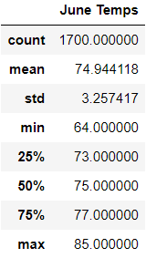
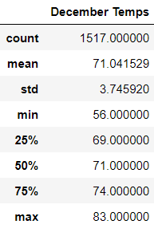

# surfs_up

## Overview

The purpose of this analysis is to highlight trends in temparature data for the island of Oahu to determine if it is sustainable to open a new surf and ice cream shop. I want to know if the shop can stay open year round and be successful. In order to do that I used Python, Pandas functions and methods, and SQLAlchemy to filter the date column of the Measurements table in the hawaii.sqlite database to retrieve all the temperatures for the month of June. I then converted the temperatures to a list, create a DataFrame and generated a summary statistics table to highlight any trends.

## Results

- The mean temperature in June is 3.9 degrees warmer than in December at 74.9 degrees and 71.0 degrees, respectfully.
- The minimum temperature in June is 8.0 degrees warmer than in December at 64.0 degrees and 56.0 degrees, respectfully.
- The maximum temperature in June is 2.0 degrees warmer than in December at 85.0 degrees and 82.0 degrees, respectfully.

## Summary

The data shows that the shop should be able to perform successfully year round with warm temperature year-round. While business may be slower at times in December due to slightly lower average temperatures and lower miniumum temperatures compared to June, the data shows that a surf and ice cream shop is sustainable on Oahu.
